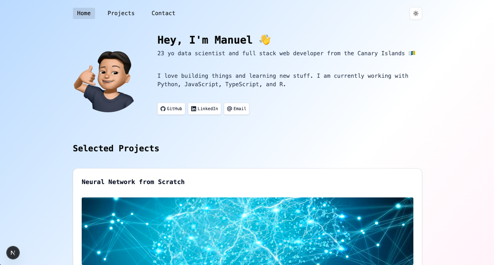

# 💼 Manuel Rodríguez Sutil — Portfolio

Welcome to my personal developer portfolio built with **Next.js 14**, **Tailwind CSS**, and **TypeScript**.  
It showcases my selected projects, skills, and a bit of personality.

---

## 🚀 Tech Stack

- **Framework**: Next.js (App Router)
- **Styling**: Tailwind CSS + Shadcn/UI
- **Language**: TypeScript
- **Content Management**: Sanity.io (for blog)
- **Deployment**: Vercel
- **Extras**:
  - Theme switcher (system/light/dark)
  - Email contact form via Nodemailer

---

## 🧱 Features

- ⚡ **Responsive Design** — Works on desktop and mobile
- 🌗 **Theme Toggle** — System theme by default with manual override
- 📬 **Working Contact Form** — Sends email via backend API route
- 🧠 **Featured Projects** — Hand-picked to reflect both technical depth and creativity

---

## 🖼 Preview

 <!-- Replace or add later if needed -->

---

## 📂 Project Structure

```bash
/app
  ├── components       # UI components (navbar, footer, cards, etc.)
  ├── data             # Project data
  ├── api              # Contact email endpoint
/public
  └── images, favicons, assets
```
